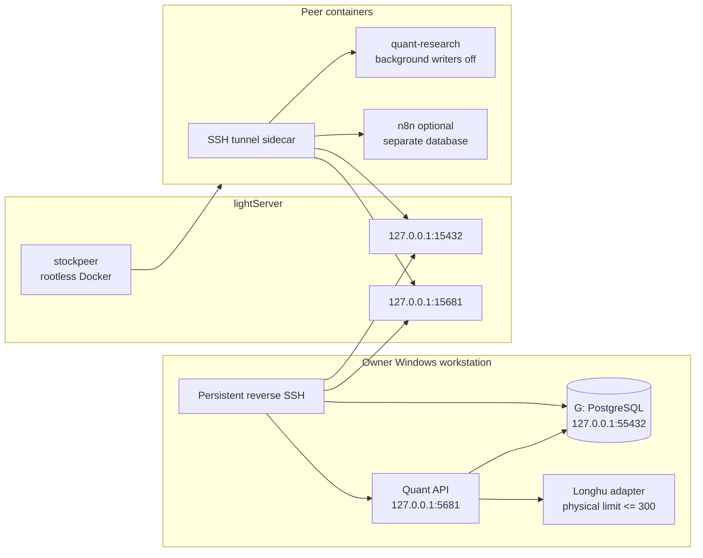

# Shared peer runtime

This deployment keeps the authoritative trading database on the owner's
`G:\StockPlatform` disk while allowing one reviewed collaborator to run the
same research code in an isolated Docker environment. It does not expose a
broker trading path and it does not copy the LonghuVIP upstream credential.

## Topology



The lightServer listeners are loopback-only. The collaborator gets full
control of the `stockpeer` rootless Docker daemon, not root access and not the
host's rootful Docker socket. A container escape therefore does not grant
lightServer root privileges.

## Ownership and writer policy

- `G:\StockPlatform\data\postgresql16` is the only authoritative quant store.
- The owner's local collector is the only scheduled market-data writer by
  default. `PEER_BACKGROUND_TASKS_ENABLED=false` prevents duplicate scans.
- The peer role inherits the application's database privileges and may run
  explicit research/migrations. Access can be revoked by disabling the role or
  removing the SSH key.
- Peer credentials are long-lived static credentials: the SSH key, database
  password, shared read/write API keys, and n8n encryption key have no scheduled
  rotation or automatic expiry. Rotate them only after suspected disclosure,
  an owner-requested revocation, or an explicit maintenance event. Plaintext
  values belong in the owner's private handoff bundle outside the checkout and
  must never be committed to Git.
- Peer n8n state uses `trading_hareness_peer_n8n`. Two independently managed
  n8n instances must not share one n8n application schema.
- Longhu reads go through `/licensed/longhu/*` with a dedicated read key. The
  upstream token and device identity stay on the owner's machine.
- List endpoints cap each physical vendor page at 300 and paginate larger
  logical reads in the adapter. Explicit quote baskets are independently
  bounded by `QUANT_LONGHU_INTRADAY_MAX_SYMBOLS`.

## Owner bootstrap

Run from an elevated PowerShell only for the one-time server account setup:

```powershell
cd F:\AIWorkflow\trading_hareness
pwsh .\scripts\shared-peer\bootstrap-local-peer.ps1
```

This creates/updates the PostgreSQL `stock_peer` role, a separate peer n8n
database, `G:\StockPlatform\peer\secrets\peer.env`, and the local shared-read
key. It prints paths and status, never secret values.

Create a dedicated SSH key under `G:\StockPlatform\peer\secrets`, copy only
the public key to lightServer, then provision the non-sudo account:

```powershell
pwsh .\scripts\shared-peer\new-peer-ssh-key.ps1
scp -P 3535 .\scripts\shared-peer\provision-lightserver-rootless.sh lightServer1:/root/
scp -P 3535 G:\StockPlatform\peer\secrets\stockpeer_ed25519.pub lightServer1:/root/
ssh lightServer1 "AUTHORIZED_KEY_FILE=/root/stockpeer_ed25519.pub bash /root/provision-lightserver-rootless.sh"
pwsh .\scripts\shared-peer\install-shared-tunnel-task.ps1
```

The scheduled tunnel task runs hidden and publishes only two lightServer
loopback ports. Verify them with:

```powershell
ssh lightServer1 "ss -lnt | grep -E '127.0.0.1:(15432|15681)'"
```

## Peer deployment

Clone the owner's fork as `stockpeer`, check out the reviewed branch, and copy
`deploy/shared-peer/.env.example` to `.env`. Fill it from the separately
delivered `peer.env`; do not commit it. The tunnel key must be owned by
`stockpeer` and mode `0600`. If the environment bundle was copied from Windows,
normalize it before sourcing it: `sed -i 's/\r$//' deploy/shared-peer/.env`.
Release activation performs this normalization automatically.

The peer image is built from a verified Linux wheelhouse so a slow or blocked
PyPI route cannot make deployment non-reproducible. On the owner workstation:

```powershell
pwsh .\scripts\shared-peer\build-peer-wheelhouse.ps1
scp -P 3535 -r G:\StockPlatform\peer\staging\wheelhouse stockpeer@<lightServer>:/home/stockpeer/
```

Before starting Compose, configure the sidecar's self-SSH path once. This key
can log in only as `stockpeer`; it cannot access root or the host rootful Docker
daemon:

```bash
cd /home/stockpeer/trading_hareness
./scripts/shared-peer/configure-peer-self-tunnel.sh <lightServer-host-or-ip> 3535
```

Set `PEER_SSH_KEY_PATH=/home/stockpeer/.ssh/peer_tunnel_ed25519` and
`PEER_KNOWN_HOSTS_PATH=/home/stockpeer/.ssh/known_hosts` in the peer `.env`.

For an owner-driven immutable release, package the reviewed worktree and
wheelhouse, copy both archives to lightServer, then run
`scripts/shared-peer/activate-peer-release.sh <repo-archive> <wheelhouse-archive>`
as root. It validates both tar archives and every wheel SHA-256 before
atomically switching `/home/stockpeer/trading_hareness` and
`/home/stockpeer/wheelhouse` symlinks. A failed validation leaves the active
release unchanged.

```bash
export XDG_RUNTIME_DIR=/run/user/$(id -u)
export DOCKER_HOST=unix://${XDG_RUNTIME_DIR}/docker.sock
docker compose --env-file .env -f deploy/shared-peer/compose.yaml config --quiet
docker compose --env-file .env -f deploy/shared-peer/compose.yaml up -d --build db-tunnel quant-research
docker compose --env-file .env -f deploy/shared-peer/compose.yaml ps
curl -fsS http://127.0.0.1:15682/health
```

Enable peer n8n only if it is needed:

```bash
docker compose --env-file .env -f deploy/shared-peer/compose.yaml --profile n8n up -d n8n
```

## Data migration

Migration is candidate-first. The current G-drive database is never overwritten
by the restore command.

On the friend's current host:

```bash
cd trading_hareness
PGHOST=... PGPORT=... PGDATABASE=... PGUSER=... PGPASSWORD=... \
  ./scripts/shared-peer/export-peer-data.sh /secure/export/path
```

The default `application.dump` contains both application schemas: `public`
(ingestion and relay records) and `quant`. Both are required because quant
research rows have foreign keys to public ingestion jobs. Set
`EXPORT_N8N_PUBLIC_SCHEMA=true` and `N8N_PGDATABASE=...` only when the separate
n8n database is also being migrated; that dump can contain encrypted
credentials and must be transported privately.

After copying `application.dump` and `application.dump.sha256` to the owner
workstation:

```powershell
pwsh .\scripts\shared-peer\prepare-peer-candidate.ps1 `
  -QuantDump G:\StockPlatform\peer\imports\<stamp>\application.dump
```

The preparation step verifies the checksum and archive, restores into
`trading_hareness_candidate`, upgrades it to the repository's Alembic head,
reimports durable stock-brain facts, and prints table/instrument counts. The
production database remains untouched.

After comparing the candidate and running API acceptance against it, stop the
local API and explicitly promote:

```powershell
pwsh .\scripts\shared-peer\promote-peer-candidate.ps1 -Promote -Confirm
pwsh .\scripts\windows\start-stock-platform.ps1
```

Promotion renames the old production database to a timestamped
`trading_hareness_rollback_*` database and then renames the candidate. The
runtime configuration does not change. Rollback is the inverse pair of
database renames while the API is stopped.

## Acceptance and failure isolation

Owner-side acceptance:

```powershell
pwsh .\scripts\shared-peer\verify-shared-runtime.ps1
```

It requires all of these to be true:

1. the G-drive database answers with its Alembic revision;
2. the local API is healthy;
3. an authenticated Longhu quote returns exactly one requested row;
4. both reverse-tunnel ports exist on lightServer;
5. optionally, the peer API is healthy when `-PeerApiBase` is provided.

Failure behavior is deliberate:

- If the Windows tunnel stops, peer services become unavailable but the local
  API/database continue unchanged.
- If peer containers fail, they cannot stop or rename the local database.
- If Longhu fails, intraday capture records the licensed-source failure and
  uses the existing Tencent/Sina fallback; it must not relabel fallback data as
  Longhu.
- If migration validation fails, do not promote. Delete/recreate only the
  candidate database and retain production.

## Revocation

Disable database access immediately:

```sql
ALTER ROLE stock_peer NOLOGIN;
```

Then remove the collaborator's public key from
`/home/stockpeer/.ssh/authorized_keys` and stop the rootless Compose project.
No local market service restart is required to revoke the peer.
