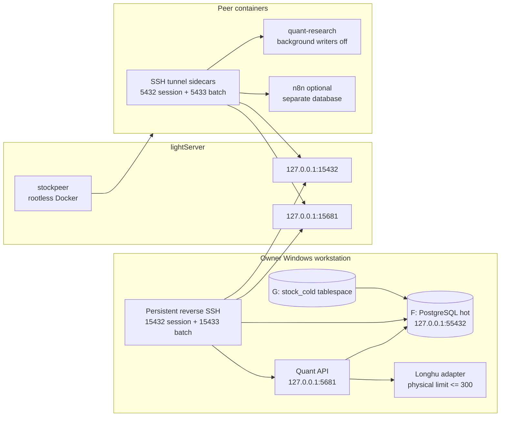

# Shared peer runtime

This deployment keeps the authoritative trading database in the owner's
current PostgreSQL runtime while allowing one reviewed collaborator to run the
same research code in an isolated Docker environment. The owner hot/cold
layout and two-lane tunnel contract are documented in
[`OWNER_DATABASE_STORAGE.md`](OWNER_DATABASE_STORAGE.md). Baidu Netdisk is an
offline backup/cold evidence tier, never a live decision source. It does not
expose a broker trading path and it does not copy the LonghuVIP upstream
credential.

The complete peer-facing stock-data contract, including all documented
actions and automatic 300-record physical batching, is in
[`SHARED_STOCK_DATA_API.md`](SHARED_STOCK_DATA_API.md).

## Topology


```mermaid
flowchart LR
  subgraph Owner[Owner Windows workstation]
    PG[(F: PostgreSQL hot\n127.0.0.1:55432)]
    COLD[(G: stock_cold tablespace)]
    API[Quant API\n127.0.0.1:5681]
    LH[Longhu adapter\nphysical limit <= 300]
    TUN[Persistent reverse SSH\n15432 session + 15433 batch]
    API --> PG
    API --> LH
    TUN --> PG
    TUN --> API
  end

  subgraph Relay[lightServer]
    DBR[127.0.0.1:15432]
    APIR[127.0.0.1:15681]
    ROOTLESS[stockpeer\nrootless Docker]
  end

  subgraph Peer[Peer containers]
    PTUN[SSH tunnel sidecars\n5432 session + 5433 batch]
    Q[quant-research\nbackground writers off]
    N[n8n optional\nseparate database]
    PTUN --> Q
    PTUN --> N
  end

  TUN --> DBR
  COLD --> PG
  TUN --> APIR
  ROOTLESS --> Peer
  PTUN --> DBR
  PTUN --> APIR
```

The lightServer listeners are loopback-only. The collaborator gets full
control of the `stockpeer` rootless Docker daemon, not root access and not the
host's rootful Docker socket. A container escape therefore does not grant
lightServer root privileges.

## Ownership and writer policy

- The deployed PostgreSQL/edge runtime is the only authoritative quant store;
  Baidu Netdisk is L3 cold evidence and is never queried by live decisions.
- The owner's local collector is the only scheduled market-data writer by
  default. `PEER_BACKGROUND_TASKS_ENABLED=false` prevents duplicate scans.
- The peer role is intentionally broad on the owner's `quant` schema (the owner
  has elected not to revoke its existing write ACLs), but it may not run
  production migrations. Actual writes are declared in
  [`PEER_WRITE_DECLARATION.md`](PEER_WRITE_DECLARATION.md) and are reconciled
  by `application_name`/owner error monitoring. `NOINHERIT` and zero parent-role
  memberships still close explicit escalation paths. The peer reads licensed
  Longhu evidence through the authenticated gateway; all recommendations and
  model outputs remain research-only. Access can be revoked by disabling the
  role or removing the SSH key.
- Peer credentials are long-lived static credentials: the SSH key, database
  password, shared read/write API keys, and n8n encryption key have no scheduled
  rotation or automatic expiry. Rotate them only after suspected disclosure,
  an owner-requested revocation, or an explicit maintenance event. Plaintext
  values belong in the owner's private handoff bundle outside the checkout and
  must never be committed to Git.
- Peer n8n state uses `trading_hareness_peer_n8n`. Two independently managed
  n8n instances must not share one n8n application schema.
- Longhu reads go through `/licensed/longhu/*` with a dedicated read key. The
  upstream token and device identity stay on the owner's machine.
- The Longhu full-market close synchronizer is retained as a staging/research
  adapter only. It is not wired into the automatic `provider=auto` daily path;
  Tushare remains the canonical daily/control source until a separate
  verified-control promotion is approved. This does not describe adjustment
  factors: the owner release now derives the cumulative factor from Longhu
  前复权 K-lines (`provider=longhu_qfq_derived`), while peer-side Tushare rows
  remain checkpoint evidence and must not overwrite the owner's repaired rows.
  The post-close control stage reads the persisted owner factor cross-section
  and never requests Tushare `adj_factor`; only `daily_basic`, `stk_limit` and
  `suspend_d` remain Tushare control requests there.
- List endpoints cap each physical vendor page at 300 and paginate larger
  logical reads in the adapter. Explicit quote baskets use the configured
  watchlist by default; `QUANT_LONGHU_INTRADAY_MAX_SYMBOLS` is only an optional
  operational lower bound and cannot exceed the remote 300-row page limit.

## Local Longhu transport boundary

The local workstation is a gateway consumer. It calls only the normalized
`/licensed/longhu/quotes`, `/licensed/longhu/minutes/{symbol}` and the batched
`/licensed/longhu/minutes?symbols=` routes through
an SSH-forwarded owner endpoint; the owner service is the only process that
stores Longhu credentials and calls the vendor API. A local
`longhu_vendor.json` is ignored unless the owner process explicitly sets
`QUANT_LONGHU_DIRECT_ENABLED=true`. The local default is `false`, so a missing
tunnel fails closed instead of silently making a direct vendor request.

On the workstation, start the bounded tunnel in a separate process. The
values below are deployment secrets and are never committed:

```bash
export LONGHU_SSH_HOST=owner.example
export LONGHU_SSH_USER=stockpeer
export LONGHU_SSH_KEY_PATH=/path/to/longhu-owner-ed25519
export LONGHU_REMOTE_PORT=15682
export LONGHU_LOCAL_PORT=15682
scripts/shared-peer/start-local-longhu-tunnel.sh
```

Set `QUANT_SHARED_READ_API_BASE_URL=http://host.docker.internal:15682` and the
separately provisioned `QUANT_SHARED_READ_API_KEY` in the ignored local `.env`,
then recreate `quant-research`. Docker Desktop resolves
`host.docker.internal` to the host-side SSH listener; the SSH `-L` bind is
loopback-only. Only normalized rows and source health cross the tunnel; vendor
tokens and raw Longhu requests stay on the owner host.

## Owner bootstrap

The following script is a legacy least-privilege hardening tool. The current
owner decision intentionally preserves the existing `stock_peer` write ACLs;
do not run its mutating mode on the shared production database unless the
owner explicitly requests a permission migration. A `-DryRun` audit is safe:

```powershell
cd F:\AIWorkflow\trading_hareness
pwsh .\scripts\shared-peer\bootstrap-local-peer.ps1 -DryRun
```

`-DryRun` only reads role inheritance and membership count,
database/schema ownership, unexpected shared database/tablespace ownership,
owned `quant` object count, executable
`SECURITY DEFINER` routine count, all write-capable `quant` relations and
writable sequences, plus
canonical-table DML, and emits a `ReadOnlyReady` boolean; it does not create
secrets, write `peer.env`, reassign objects or change grants.

Its non-dry-run path creates/updates roles and revokes privileges for a
different least-privilege deployment profile; that is not the current peer
contract. The active owner role remains broad but is monitored against
[`PEER_WRITE_DECLARATION.md`](PEER_WRITE_DECLARATION.md), uses
`statement_timeout=15min` and `idle_in_transaction_session_timeout=5min`, and
must not be silently narrowed by a release script.

Create a dedicated SSH key under `G:\StockPlatform\peer\secrets`, copy only
the public key to lightServer, then provision the non-sudo account:

```powershell
pwsh .\scripts\shared-peer\new-peer-ssh-key.ps1
scp -P 3535 .\scripts\shared-peer\provision-lightserver-rootless.sh lightServer1:/root/
scp -P 3535 G:\StockPlatform\peer\secrets\stockpeer_ed25519.pub lightServer1:/root/
ssh lightServer1 "AUTHORIZED_KEY_FILE=/root/stockpeer_ed25519.pub bash /root/provision-lightserver-rootless.sh"
pwsh .\scripts\shared-peer\install-shared-tunnel-task.ps1
```

The scheduled tunnel task runs hidden and publishes the session/API ports. The
owner independent batch task publishes `127.0.0.1:15433`; the peer's normal
`db-tunnel` entrypoint forwards it as container port `5433`. The legacy
`db-batch-tunnel` sidecar is optional. Verify both reverse endpoints with:

```powershell
ssh lightServer1 "ss -lnt | grep -E '127.0.0.1:(15432|15433|15681)'"
```

If the local `lightServer1` SSH alias points at a stale overlay address, the
PowerShell tunnel scripts also accept the documented direct endpoint without
changing the scheduled-task implementation:

```powershell
pwsh .\scripts\shared-peer\start-shared-tunnels.ps1 `
  -SshHost 47.110.79.189 -SshPort 3535 -SshUser stockpeer `
  -SshKeyPath '<peer-key-path>' -KnownHostsPath '<known-hosts-path>'
pwsh .\scripts\shared-peer\start-shared-peer-batch-tunnel.ps1 `
  -SshHost 47.110.79.189 -SshPort 3535 -SshUser stockpeer `
  -SshKeyPath '<peer-key-path>' -KnownHostsPath '<known-hosts-path>'
```

The same values can be supplied through `PEER_SSH_HOST`, `PEER_SSH_PORT`,
`PEER_SSH_USER`, `PEER_SSH_KEY_PATH` and `PEER_KNOWN_HOSTS_PATH`; the default
alias remains unchanged for existing installations. When the key or known
hosts path is supplied, the PowerShell scripts pass `IdentitiesOnly=yes` and
`StrictHostKeyChecking=yes` explicitly, so a reconnect does not silently fall
back to another user key or an unpinned host identity.

## Peer deployment

### Owner deployment announcements

The owner publishes an append-only `quant.owner_deploy_events` row before a
release can interrupt a surface.  The peer exposes the read-only projection as
`/health.owner_deploy`: `idle` means no open announcement; `in_progress` means
the newest `starting` row has no later `completed`/`failed` row for the same
`deploy_id`.  Treat an in-progress announcement as an expected transient and
retry.  If `surfaces.shared_tunnel` is `true`, pause peer writes until the
matching terminal event appears; an HTTP-only release does not require a
database write pause.  The projection is observational and never writes the
owner table.  If the table is absent on an older owner release it reports
`unavailable` without turning the service into a restart loop.

Clone the owner's fork as `stockpeer`, check out the reviewed branch, and copy
`deploy/shared-peer/.env.example` to `.env`. Fill it from the separately
delivered `peer.env`; do not commit it. The tunnel key must be owned by
`stockpeer` and mode `0600`. If the environment bundle was copied from Windows,
normalize it before sourcing it: `sed -i 's/\r$//' deploy/shared-peer/.env`.
Release activation performs this normalization automatically.

Activation also rejects an archive that lacks the two-lane compose override,
the batch-capable SSH entrypoint, the owner-cutover verifier, the bounded
batch-tunnel helper, or the systemd scripts/docs/frontend/workflow assets used
by the running release. The peer startup gate reads the owner's live
`/api/v1/peer/contract` through the shared read gateway and records a
report-only receipt before an operator may turn on blocking mode. The gate
deliberately does not require owner-only semantic columns, guard indexes,
market-data `_cold` twins, or peer migrations.
This prevents a stale session-only release or an incompatible later release
from silently replacing the owner-aware runtime. It also fills the immutable
`PEER_APP_RELEASE`/`PEER_EXPECTED_RELEASE` provenance fields when they are
still placeholders; Compose passes these as Docker build arguments, and the
cutover verifier refuses a health response whose release is missing or
`unknown`.

The peer image is built from a verified Linux wheelhouse so a slow or blocked
PyPI route cannot make deployment non-reproducible. On the owner workstation:

```powershell
pwsh .\scripts\shared-peer\build-peer-wheelhouse.ps1
scp -P 3535 -r G:\StockPlatform\peer\staging\wheelhouse stockpeer@<lightServer>:/home/stockpeer/
```

Before starting Compose, configure the sidecar's self-SSH path once. This key
can log in only as `stockpeer`; it cannot access root or the host rootful Docker
daemon:

```bash
cd /home/stockpeer/trading_hareness
./scripts/shared-peer/configure-peer-self-tunnel.sh <lightServer-host-or-ip> 3535
```

Set `PEER_SSH_KEY_PATH=/home/stockpeer/.ssh/peer_tunnel_ed25519` and
`PEER_KNOWN_HOSTS_PATH=/home/stockpeer/.ssh/known_hosts` in the peer `.env`.
Keep `PEER_REQUIRE_OWNER_SEMANTICS=true` in the peer `.env`; set
`PEER_OWNER_CONTRACT_MODE=report_only` for the first restart. After a valid
receipt exists and the owner contract is stable, `block` can be enabled to
fail closed on an unavailable or malformed contract. Factor semantics are
read from `daily_adjustment_factors.raw`; a missing factor row remains a
research-data quality block, not a schema error.

For an owner-driven immutable release, package the reviewed worktree and
wheelhouse, copy both archives to lightServer, then run
`scripts/shared-peer/activate-peer-release.sh <repo-archive> <wheelhouse-archive>`
as root. It validates both tar archives and every wheel SHA-256 before
atomically switching `/home/stockpeer/trading_hareness` and
`/home/stockpeer/wheelhouse` symlinks. A failed validation leaves the active
release unchanged.

```bash
export XDG_RUNTIME_DIR=/run/user/$(id -u)
export DOCKER_HOST=unix://${XDG_RUNTIME_DIR}/docker.sock
docker compose --env-file .env -f deploy/shared-peer/compose.yaml config --quiet
docker compose --env-file .env \
  -f deploy/shared-peer/compose.yaml \
  -f deploy/shared-peer/compose.intraday-owner.yaml config --quiet
docker compose --env-file .env \
  -f deploy/shared-peer/compose.yaml \
  -f deploy/shared-peer/compose.intraday-owner.yaml \
  up -d --build db-tunnel quant-research quant-research-scheduler
docker compose --env-file .env -f deploy/shared-peer/compose.yaml -f deploy/shared-peer/compose.intraday-owner.yaml ps
curl -fsS http://127.0.0.1:15682/health
python3 - <<'PY'
import os, requests
r = requests.get(os.environ['QUANT_SHARED_READ_API_BASE_URL'].rstrip('/') + '/api/v1/peer/contract',
                 headers={'X-Quant-Read-Key': os.environ['QUANT_SHARED_READ_API_KEY']}, timeout=10)
r.raise_for_status(); print(r.json()['alembic_head'])
PY
python3 scripts/shared-peer/verify-owner-cutover.py --stage lane \
  --expected-release "${PEER_EXPECTED_RELEASE}"
```

Both `quant-research` and `quant-research-scheduler` deliberately use the
same `PEER_QUANT_IMAGE` and the same `Dockerfile.peer` build.  The `--build`
flag is therefore required on a source release; recreating only the scheduler
from a pre-existing `:latest` tag can silently leave post-close jobs on the
old factor/instrument implementation.

If the existing `db-tunnel` image predates the two-lane entrypoint, rebuild only
`db-tunnel`; do not substitute the optional compatibility sidecar. The normal
health check and verifier perform SQL read-back through both `5432` and `5433`.

Do not switch the research scheduler merely because port 15433 is listening.
First require a real SQL read-back through 5433 and the live owner contract;
after the scheduler switch, verify the final lane as
well:

```bash
python3 scripts/shared-peer/verify-owner-cutover.py --stage lane
# set PEER_RESEARCH_DB_HOST=db-tunnel, PEER_RESEARCH_DB_PORT=5433 and
# PEER_REQUIRE_OWNER_CUTOVER=true,
# then recreate quant-research-scheduler
python3 scripts/shared-peer/verify-owner-cutover.py --stage complete
```

Both commands are read-only and emit one JSON receipt. A `blocked` result must
not be overridden by starting research jobs on the partially migrated layout.

Enable peer n8n only if it is needed:

```bash
docker compose --env-file .env -f deploy/shared-peer/compose.yaml --profile n8n up -d n8n
```

## Data migration

Migration is candidate-first. The current G-drive database is never overwritten
by the restore command.

On the friend's current host:

```bash
cd trading_hareness
PGHOST=... PGPORT=... PGDATABASE=... PGUSER=... PGPASSWORD=... \
  ./scripts/shared-peer/export-peer-data.sh /secure/export/path
```

The default `application.dump` contains both application schemas: `public`
(ingestion and relay records) and `quant`. Both are required because quant
research rows have foreign keys to public ingestion jobs. Set
`EXPORT_N8N_PUBLIC_SCHEMA=true` and `N8N_PGDATABASE=...` only when the separate
n8n database is also being migrated; that dump can contain encrypted
credentials and must be transported privately.

After copying `application.dump` and `application.dump.sha256` to the owner
workstation:

```powershell
pwsh .\scripts\shared-peer\prepare-peer-candidate.ps1 `
  -QuantDump G:\StockPlatform\peer\imports\<stamp>\application.dump
```

The preparation step verifies the checksum and archive, restores into
`trading_hareness_candidate`, upgrades it to the repository's Alembic head,
reimports durable stock-brain facts, and prints table/instrument counts. The
production database remains untouched.

After comparing the candidate and running API acceptance against it, stop the
local API and explicitly promote:

```powershell
pwsh .\scripts\shared-peer\promote-peer-candidate.ps1 -Promote -Confirm
pwsh .\scripts\windows\start-stock-platform.ps1
```

Promotion renames the old production database to a timestamped
`trading_hareness_rollback_*` database and then renames the candidate. The
runtime configuration does not change. Rollback is the inverse pair of
database renames while the API is stopped.

## Acceptance and failure isolation

Owner-side acceptance:

```powershell
pwsh .\scripts\shared-peer\verify-shared-runtime.ps1
```

It requires all of these to be true:

1. the G-drive database answers with its Alembic revision;
2. the local API is healthy;
3. an authenticated Longhu quote returns exactly one requested row;
4. both reverse-tunnel ports exist on lightServer;
5. optionally, the peer API is healthy when `-PeerApiBase` is provided.

Failure behavior is deliberate:

- If the Windows tunnel stops, peer services become unavailable but the local
  API/database continue unchanged.
- If peer containers fail, they cannot stop or rename the local database.
- If Longhu fails, intraday capture records the licensed-source failure and
  uses the existing Tencent/Sina fallback; it must not relabel fallback data as
  Longhu.
- If migration validation fails, do not promote. Delete/recreate only the
  candidate database and retain production.

## Revocation

Disable database access immediately:

```sql
ALTER ROLE stock_peer NOLOGIN;
```

Then remove the collaborator's public key from
`/home/stockpeer/.ssh/authorized_keys` and stop the rootless Compose project.
No local market service restart is required to revoke the peer.
